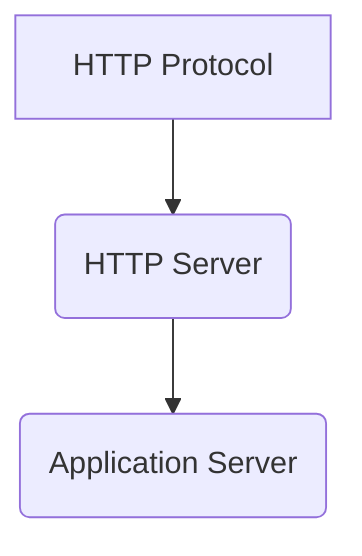

# Scalability 101
### When does we need to scale our software?
[CS291](https://cs291.com/slides/2024f/01_course_introduction/index.html#33) has a good and clear definition of scalability.
> An Internet service is scalable if increasing demands can be effectively met with increasing capacity.

Demand can be traffic quantity or dataset size (exponential growth).
### What does it mean by effectively meet demands?
> Service remains available. Response time does not excessively degrade.

What do you do when your software no longer effectively meet demand?
### Prerequisites knowledge concept before digging into real problem

